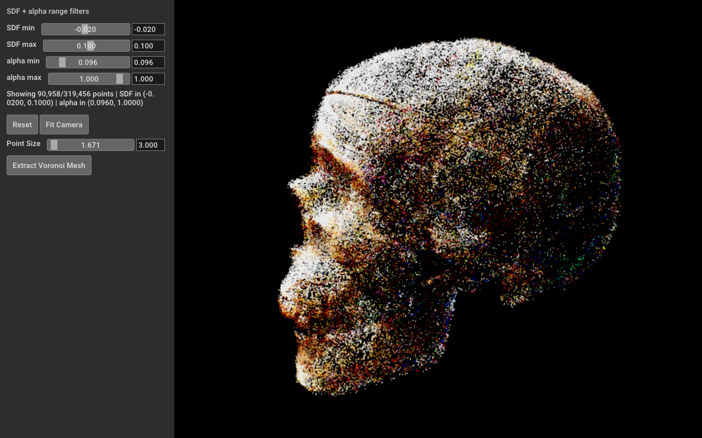

# SDFoam: Signed-Distance Foam for Explicit Surface Reconstruction


## Antonella Rech, Nicola Conci, Nicola Garau

<p align="center">
  <a href="https://mmlab-cv.github.io/SDFoam/">
    
  </a>
  <a href="https://openaccess.thecvf.com/content/CVPR2026W/3DMV/papers/Rech_SDFoam_Signed-Distance_Foam_for_explicit_surface_reconstruction_CVPRW_2026_paper.pdf">
    
  </a>
</p>

SDFoam jointly optimizes an implicit Signed Distance Field (SDF) and an
explicit Voronoi Diagram, or foam, for ray-traced scene representation and mesh
reconstruction. The model keeps the speed and explicit structure of
RadiantFoam while using SDF supervision and regularization to improve surface
quality, reduce floaters, and extract cleaner meshes.

This branch contains the current setup used for training,
live viewing, and SDF/alpha-based Voronoi mesh extraction.

## Overview

NeRF-style methods produce strong novel-view synthesis but often make mesh
extraction difficult. RadiantFoam organizes radiance with explicit Voronoi
cells and ray tracing, but precise surface reconstruction can still suffer from
holes and floaters. SDFoam addresses this by learning an SDF together with the
Voronoi foam. The SDF gives a metric surface signal, and the foam provides an
explicit non-overlapping structure for rendering and mesh extraction.

## Requirements

The current workflow has been tested on Windows with:

- Windows 10/11 (though easily portable to Linux)
- NVIDIA GPU with CUDA support
- CUDA Toolkit 13.2, with `nvcc` available on `PATH`
- Visual Studio 2022 Build Tools with the C++ desktop workload
- Python 3.12
- `uv`
- Git

The setup installs PyTorch CUDA 13.2 wheels:

- `torch==2.12.0+cu132`
- `torchvision==0.27.0+cu132`

## Quick Setup

From a fresh checkout:

```powershell
git clone --recursive https://github.com/mmlab-cv/SDFoam.git
cd SDFoam

uv venv .venv
.venv\Scripts\activate

uv pip install -r requirements.txt
uv pip install --reinstall torch torchvision --index-url https://download.pytorch.org/whl/cu132
uv pip install .

python train.py -c configs\dtu_scan.yaml --viewer
```

## Training

Training uses a YAML config:

```powershell
python train.py -c configs\dtu_scan.yaml
```

To launch the native training viewer at the same time:

```powershell
python train.py -c configs\dtu_scan.yaml --viewer
```

Runs are saved under `output/<scene_name>_<mode>@<timestamp>/`. A completed
or intermediate run should contain at least:

```text
output/<run>/config.yaml
output/<run>/model.pt
```

Use the generated `config.yaml` when opening a trained run in a viewer.

## SDF + Alpha Voronoi Viewer

This is the current mesh-inspection viewer. It filters Voronoi sites using SDF
and alpha values, shows the selected geometry, and exports colored mesh files.



```powershell
python gui.py -c .\output\<run>\config.yaml
```

## Headless Mesh Extraction

If you want to extract the Voronoi mesh without opening the Open3D GUI, use
`extract_mesh.py` with the checkpoint config:

```powershell
python extract_mesh.py -c .\output\<run>\config.yaml
```

The default extraction keeps seeds in this range:

```text
-0.02 < SDF < 0.05
0.096 < alpha < 1.0
```

You can override the thresholds and output name:

```powershell
python extract_mesh.py -c .\output\<run>\config.yaml --sdf_min -0.02 --sdf_max 0.05 --alpha_min 0.096 --alpha_max 1.0 --out_base scan65_mesh
```

The script writes colored mesh files using the selected base name:

```text
scan65_mesh.ply
scan65_mesh.obj
scan65_mesh.mtl
```

## CMake Development Build

Use this path if you are editing C++ or CUDA code and want incremental rebuilds:

```powershell
mkdir build
cd build
cmake ..
cmake --build . --config Release --target install
cd ..
python train.py -c configs\dtu_scan.yaml --viewer
```

`uv pip install .` and the direct CMake flow now use the same CMake project and
install the Python bindings into the local package.

## Credits

This repository structure is based on the Radiant Foam codebase:
[theialab/radfoam](https://github.com/theialab/radfoam).

## BibTeX

```bibtex
@inproceedings{rech2026sdfoam,
  title={SDFoam: Signed-Distance Foam for explicit surface reconstruction},
  author={Rech, Antonella and Conci, Nicola and Garau, Nicola},
  booktitle={Proceedings of the IEEE/CVF Conference on Computer Vision and Pattern Recognition},
  pages={300--308},
  year={2026}
}
```
